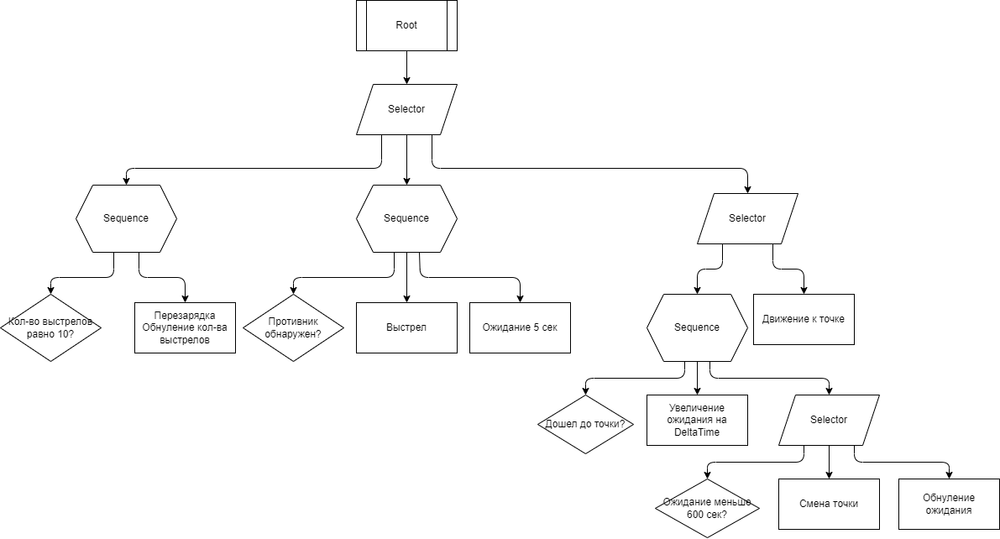

# Test-task-for-Saber-Interactive
## Тест для соискателей вакансии
## Программист игровой логики
Техническое задание:

**1. Реализуйте функции сериализации и десериализации двусвязного списка, заданного следующим
образом:**
``` c#
 class ListNode
 {
    public ListNode Prev;
    public ListNode Next;
    public ListNode Rand; // произвольный элемент внутри списка
    public string Data;
 }
 class ListRand
 {
    public ListNode Head;
    public ListNode Tail;
    public int Count;
    public void Serialize(FileStream s){}
    public void Deserialize(FileStream s){}
 }
 ```

**2. Напишите ИИ для противника используя BhvTree (достаточно нарисовать схему, реализация в каком-либо из движков не требуется).**
   
Солдат - сущность, которая может стрелять, перезаряжаться, отправиться в указанную точку и ждать.

Солдат проводит патруль по зацикленному маршруту по точкам А и Б

По прибытии на точку солдат останавливается на 10 минут в ожидании врага. Если за 10 минут враг непоявился, солдат идет на следующую точку.

Если враг обнаружен (на любой дистанции), солдат производит 10 выстрелов с паузой 5 секунд между каждым.

